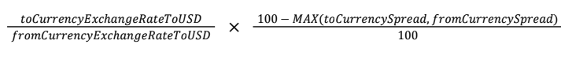

# GOALS
This project aims to create an FX calculator. It gets exchange rates from [data.fixer.io](http://data.fixer.io/api/latest) `everyday 00:05 AM GMT`, persist data in a [Postgresql](https://hub.docker.com/_/postgres) database. User can get cross currency rates, parity, by calling this applications API.

# Limitations
Public API of _data.fixer.io_ gives rates with a random base for free subscription. In this project, we have `EUR` as `BASE_CURRENCY`. 

# Spread Calculation

|     **Currency**    | **Spread Percentage** |
|:-------------------:|:---------------------:|
| EUR (Base Currency) |         0.00%         |
|     JPY, HKD KRW    |         3.25%         |
|    MYR, INR, MXN    |         4.50%         |
|    RUB, CNY, ZAR    |         6.00%         |
|   Everything else   |         2.75%         |


 

# Free fixer.io API Endpoint (100 / mo)
http://data.fixer.io/api/latest?access_key=2b217926d3e442385560b57adb25b338&format=1


# To run Database locally
Make sure you have docker driver installed in your local.
```bash
docker volume create postgres_database
docker run -d --name postgres -e POSTGRES_PASSWORD=postgres -e POSTGRES_DB=postgres -v postgres_database:/var/lib/postgresql/data -p 5432:5432 postgres
```

# To run Application locally
`mvn install && mvn spring-boot:run`

## Experimental run with docker-compose
It should create a database container and run application with below command.

`docker-compose up`

# To check API Documentation
Make sure you are running application locally. Afterwards, go to 

[Swagger Docs](http://localhost:8080/swagger-ui.html#/)

# PSQL Commands to check DB Tables
```bash
docker exec -it postgres bash
su - postgres
psql
\c postgres
\dt
select * from request_count;
select * from exchange_rate;
```


# References
- https://www.bezkoder.com/spring-boot-postgresql-example/
- https://fixer.io/documentation
- https://code.visualstudio.com/docs/java/java-spring-boot
- https://zetcode.com/springboot/schedulingtasks/
- https://www.baeldung.com/spring-boot-postgresql-docker
- https://mkyong.com/spring-boot/spring-boot-spring-data-jpa/
- https://ionutbanu.medium.com/build-spring-boot-docker-image-using-multi-stage-dockerfile-2-13b9f1e89393
- https://medium.com/codex/how-to-persist-and-backup-data-of-a-postgresql-docker-container-9fe269ff4334
- https://medium.com/kodluyoruz/spring-boot-ile-swagger-kullan%C4%B1m%C4%B1-14ae99c6eca7
- https://www.blazemeter.com/blog/spring-boot-rest-api-unit-testing-with-junit
- Any so much stackoverflow pages for error debugging :)